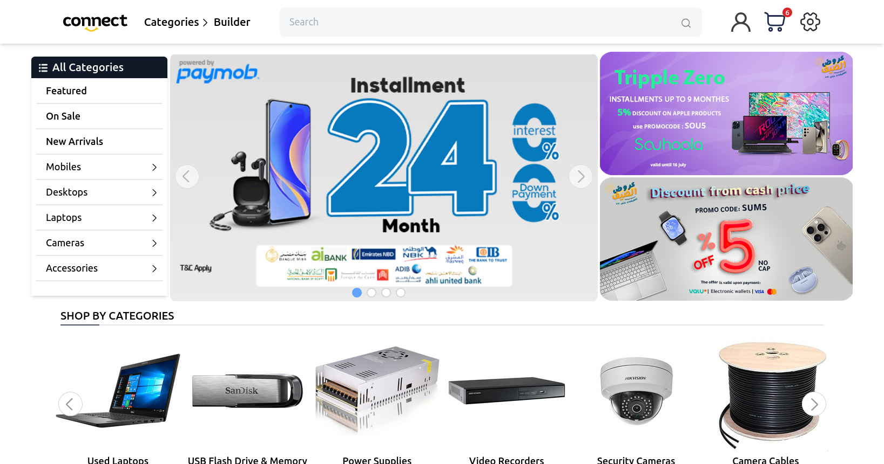

<a id="readme-top"></a>
<br />
<div align="center">
</div>


## About The Project
A E-store where customers can browse and order products with features including:<br>
Approved trader accounts for bulk ordering in wholesale prices<br>
Security camera system builder for bundling compatible parts in an order<br>
Dynamic filtering populated by product specifications for individual categories. 

<p align="right">(<a href="#readme-top">back to top</a>)</p>


### Built With

[![Laravel]][Laravel-url]
[![tailwindcss]][Tailwind-url]
[](https://connectstore.vercel.app)


<p align="right">(<a href="#readme-top">back to top</a>)</p>


### Installation
   
1. Install Composer, PHP and NPM

2. Install Composer Packages
   ```sh
   composer install 
   ```
3. Install NPM Packages
   ```sh
   npm i 
   ```
4. Run Migrations
   ```js
   php artisan migrate
   ```

5. Build Front-end files 
   ```js
   npm run build
   ```

7. Run Server
   ```js
   php artisan serve
   ```


<p align="right">(<a href="#readme-top">back to top</a>)</p>

## Contact

Whatsapp: 01228473230<br>
Linkedin: https://www.linkedin.com/in/ahmed-hassan-abozed-6271b223a<br>
Portfolio: https://ahmdabozed.github.io<br>
Project Live: https://connectstore.vercel.app<br>

<p align="right">(<a href="#readme-top">back to top</a>)</p>


[Vue.js]: https://img.shields.io/badge/Vue.js-4FC08D?style=for-the-badge&logo=vuedotjs&logoColor=white
[Vue-url]: https://vuejs.org/
[tailwindcss]: https://img.shields.io/badge/Tailwindcss-06B6D4?style=for-the-badge&logo=tailwindcss&logoColor=white
[Tailwind-url]: https://tailwindcss.com/
[Laravel]: https://img.shields.io/badge/Laravel-FF2D20?style=for-the-badge&logo=laravel&logoColor=white
[Laravel-url]: https://laravel.com/